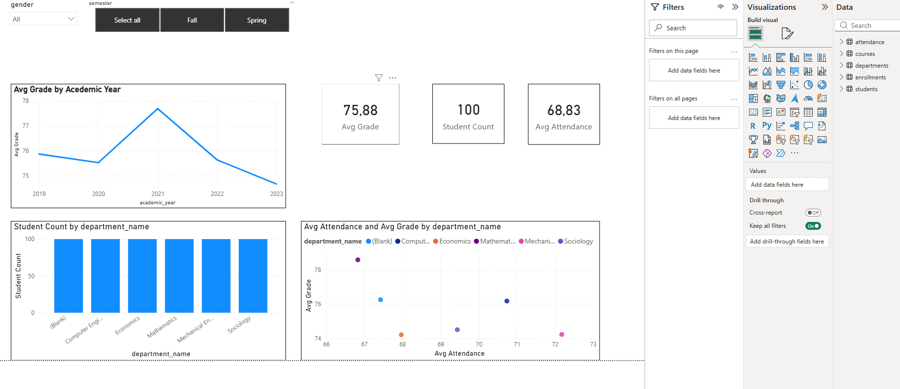

# 🎓 Student Performance & Attendance Dashboard

## 📌 Project Overview
An interactive Power BI dashboard designed to analyze academic performance 
and attendance trends across university departments and semesters.

## 📊 Key Findings
- Positive relationship identified between **attendance and student performance**
- Departmental performance comparison using attendance and grade metrics
- Academic performance trends analyzed across years and departments

## ✨ Features
- Structured data model with multiple related tables for scalable analysis
- Dynamic filters by **semester** and **gender** for flexible exploration
- Interactive dashboards for department and trend analysis

## 🛠️ Tools & Technologies
`Power BI` `DAX` `Power Query` `Data Modeling`

## 📁 Files
| File | Description |
|------|-------------|
| `University_Data_Project.pbit` | Power BI template file |

## 📸 Dashboard Preview

